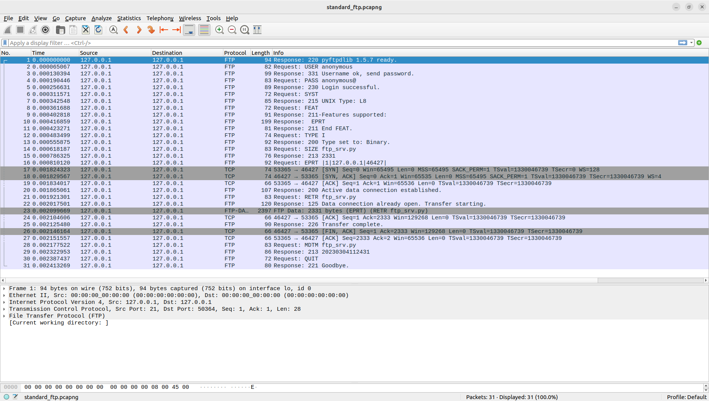

# CS305 2023 Spring Assignment 1 - FTP Server

## CHANGELOG

**Apr. 1, 2023**:

You have all done GREAT! Now this repository will be archived. 

If you still have any questions about this assignment, FTP protocol, or CS305, you are welcome to contact me through QQ or Email.

**Mar. 28, 2023**:
1. Section "If you cannot capture packets in WSL..."

**Mar. 23, 2023**:
1. Instructions on how to let Wireshark decode the packets.
2. Clarify grading requirements on Other Tasks. Your report should now include necessary explanations to your code that implements Other Tasks.

**Mar. 22, 2023**:
1. Add instructions for user privilege control to allow anonymous writes.
2. Delete from Task 2 "Client down" because it needs transport layer operations.
3. Add the usage for the [testing script](https://github.com/dazhi0619/CS305-23S-Assignment1/releases).

**Mar. 18, 2023**:
1. Delete from Task 2 "File transmission before connection" to avoid ambiguity.
2. Correct the format of EPRT command.

## Introduction

Quote from Wikipedia:

> The **File Transfer Protocol (FTP)** is a standard communication protocol used for the transfer of computer files from a server to a client on a computer network. FTP is built on the C/S model architecture using **separate control and data connections** between the client and the server.

The goal of this assignment is to implement an **FTP Server** in Python. Minimally, your program should be able to support file retrieving and storing. To achieve a satisfactory score, your program should be capable of handling errors and avoiding crashes. After finishing this assignment, you will be able to conveniently share files with your friends and between your devices in a geeky, nostalgic, and interesting way.

Unfortunately, FTP is a highly developed protocol, so there is not much information or blog posts about the details. We try to include everything you need in this document, but if there is anything we miss, feel free to raise an issue in this [GitHub repository](https://github.com/dazhi0619/CS305-23S-Assignment1). You can also alternatively read the following document and figure it out for your own sake:

- Wikipedia:
  - [File Transfer Protocol](https://en.wikipedia.org/wiki/File_Transfer_Protocol)
  - [List of FTP commands](https://en.wikipedia.org/wiki/List_of_FTP_commands)
  - [List of FTP server return codes](https://en.wikipedia.org/wiki/List_of_FTP_server_return_codes)
- [RFC 959](https://datatracker.ietf.org/doc/html/rfc959): Definition of FTP
- [RFC 2428](https://datatracker.ietf.org/doc/html/rfc2428): Definition of EPRT and EPSV commands
- [RFC 5797](https://datatracker.ietf.org/doc/html/rfc5797): List of all FTP commands

In case you know nothing about RFC, A **Request for Commands**(RFC) is a publication in a series from IETF which is in charge of setting the standards. All internet standards are defined in RFCs. Unfortunately, they are also known to be notoriously hard to understand. If you need extra help reading them, refer to [this](https://www.mnot.net/blog/2018/07/31/read_rfc).

Don't be frightened. The workload for this assignment is not as frightening as at the first glance. The estimated time to score 90 is 5 hours - Seems pretty easy to finish in 2 weeks, right? It may be hard for you at first, but after you figure out how FTP works, you will definitely make it!

## Introduction to FTP

FTP protocol uses TCP socket (you can use socket in Python) for file transmission. There are two modes for FTP: **standard** mode and **passive** mode. In standard mode, before transmitting the files, the client will send the server the address and the port number of the client, and then the server will connect to the designated address. In passive mode, the server will open a port and send the port number to the client, and after that, the server will wait for the client to connect to it. For this assignment, you only need to implement the standard mode. The FTP commands and responses will be illustrated here, while how to send these responses will be covered in the step-by-step tutorial section.

FTP clients use the following commands:

| CMD | Description                                                                | Usage                          |
| ------- | -------------------------------------------------------------------------- | ------------------------------ |
| USER    | Authentication username.                                                   | USER username                  |
| PASS    | Authentication password.                                                   | PASS password                  |
| PORT    | Specifies an address and port to which the server should connect.          | PORT xxx,xxx,xxx,xxx,yyy,yyy   |
| EPRT    | Specifies an extended address and port to which the server should connect. | EPRT \|v\|xxx.xxx.xxx.xxx\|yyyyy\| |
| QUIT    | Disconnect.                                                                | QUIT                           |
| STOR    | Accept the data and store the data as a file at the server side.           | STOR filename                  |
| RETR    | Retrieve a copy of the file.                                               | RETR filename                  |
| SYST    | Return system type.                                                        | SYST                           |
| SIZE    | Return the size of a file.                                                 | SIZE filename                  |

In the above table, v represents the version of IP (1 for IPv4, 2 for IPv6), xxx represents a segment of the IP address, and yyy represents the port number. For example, if the client IP is 127.0.0.1, and the port number is 34567, then the PORT and the EPRT command sent by the client should be

```
PORT 127,0,0,1,135,7
EPRT |1|127.0.0.1|34567|
```

Note that the port number in the PORT command is calculated like this: $135 \times 256+7=34567$(256 is a constant). In one connection, either PORT or EPRT will be sent by the client; usually, EPRT is preferred, and if it is not supported, PORT will be used.

Each command should be ended with `\r\n`, not `\r` or `\n`. Otherwise, the command is considered as incomplete.

In response to the commands, the server will respond with a 3-digit status code, followed by a sentence explaining the status code. For the meaning and common usage, you can refer to [this](https://en.wikipedia.org/wiki/List_of_FTP_server_return_codes). The same as commands, each response must be ended with `\r\n`.

Here are some common responses from the server:

- 220 CS305 FTP server ready. (Welcome message. You can modify the part after 220)
- 331 Username ok, send password. (Optional)
- 230 Login successful.
- 200 Type set to binary.
- 213 xxxx (xxxx represents the size of the file)
- 200 Active data connection established.
- 125 Data connection already open. Transfer starting.
- 226 Transfer complete.
- 221 Goodbye.
- 504 Command not implemented for that parameter.
- 502 Command not implemented.
- 421 Service not available, closing control connection.
- 425 Can't open data connection.
- 426 Connection closed; transfer aborted.
- 430 Invalid username or password.
- 530 Not logged in.
- 534 Request denied for policy reasons.

The code is for the client program, and the sentence is for the user to read about the response. So you can customize the messages, as long as the code is correct. These are not compulsory, i.e. you do not need to implement all of them.

Basically, the procedure of an FTP connection is the client sending a command and then the server responding to the client. To give you an overview of a complete connection, here is a screenshot of the packets:



In this screenshot, the commands are the ones after "Request: ", and the responses are after "Response: ". CRLF(`\r\n`) is ignored in the screenshot but you should **not** forget it. The grey items are TCP connections for data transfer. This file is also provided in the GitHub repository. If you try to use Wireshark to capture the connection on your own machine, you can use `ftp || tcp.port == 12345` as the filter given that the port of the data connection is 12345.

## Environment Setup

Please use Python 3.9 running on a Linux system or WSL. Windows and macOS **may** work, although we don't have machines to test. Theoretically speaking, any system that can run Python and support `ftp` command should be fine.

## Tasks

In the following tasks you can **ONLY** use the Python standard library, **excluding** the `ftplib` module. Failure to comply with this rule will lead to a 0 score for this assignment, and the result cannot be appealed. You can use the skeleton code provided to you, but remember to change the content. The maximum score for this assignment is 100.

### Task 1: Implement basic file transferring (60 pts)

In this task, you should implement a basic FTP server that can:

- Handle connections (10 pts): Listen on port 52305 (Usually FTP servers listen on port 21, but here to avoid security concerns, we use port 52305), accept connections, and close connections upon QUIT command. After closing a connection, it should continue to wait for succeeding connections. You should change the welcome message to your SID. For example, if my SID is 12116666, the welcome message should be: `220 12116666 ready.`
- Anonymous logins (10 pts): Correctly handle USER command. After the user sends the username, the server should acknowledge that the login is successful.
- Transfer files (40 pts in total): Correctly handle RETR (20 pts) and STOR (20 pts) commands. Your server should be able to properly receive and store a file whose name and content are random strings and to properly transfer a file to the client, with its filename and content not modified. You do not need to handle errors to get the points for this task.

### Task 2: Error handling (30 pts)

In this task, you should optimize your server so that it can handle:

- File errors (10 pts): File not exist, file not accessible, illegal filename.
- Command errors (10 pts): Operations before login, illegal command (format error, command unrecognized, linefeed error).
- Connection errors (10 pts): Connection establishment failure (e.g. the address given by EPRT command is unavailable), connection interrupted (e.g. the data or the control connection breaks up when transmitting files)

### Other Tasks (10 pts)

For the remaining 10 points, you can implement one or more of the following features (Or no feature if you like):

- User login control (5 pts): Store a list of users and the corresponding passwords on the hard drive, and determine if the username and password combination given by the client is correct when accepting connections.
- User privilege control (5 pts): In the list of users from user login control, distinguish ordinary users and superusers, and only the superusers will be allowed to store files. If you choose to implement this task, you should also give anonymous users privilege to write files to pass the test of Task 1.
- Passive mode (5-10 pts): Implement the passive mode where the address of the data connection is chosen by the server who waits for the connection from clients. If you can handle connection establishment errors and connection interruption, you can get 10 points.
- More commands (2 pts each): Implement more commands other than those required in Task 1 and 2. For example, FEAT, HELP, PWD, RMD, TYPE, and LIST.

If you receive more than 10 points in this section, it can be a complement to previous tasks, but the overall score will not exceed 100. E.g. my scores for tasks 1 and 2 are 60 and 25, and I get 20 points in this section, the final score will be 100.

## Step-by-step Tutorial

To implement an FTP server, you need to handle various client commands. Here we use two commands, `USER` and `STOR`, as examples to illustrate how to implement the FTP server. You should similarly implement the other commands. It is worth mentioning that the examples are not exhaustive, and you may need to implement other features to meet your specific needs. 

Now let's consider the `USER` command. In this example, we will assume that the client is in anonymous mode, i.e., the client does not have to provide any user identification information to the server.

When the server receives the `USER` command from the client, it should record the information of the client and send a message back to inform the client that it now has the username and requires the password. You can use the `client.send()` method to send a message to the client through the control connection socket that has already been established.

Here's an example code block that implements this behavior, which was part of the skeleton file and is now excluded:

```python
if command[:4] == "USER":
    message = b"331 Username ok, send passwork.\r\n"
    client.send(message)
```

Note that the message needs to be encoded as bytes before sending, as data transmission is implemented in binary. Also, make sure to include the `\r\n` characters at the end of the message to indicate the end of the message or command. Keep in mind that this is a simple example and you may need to modify this code block to match your specific needs. Additionally, it's important to note that re-establishing a socket to the same client with the same port will result in an error, so be careful not to do this.

Another example is the following code:

```python
 elif command[:4] == "STOR":
    # Establish data connection
    data_sock = socket.socket()
    data_sock.connect((client_ip, client_port))
    client.send(b"125 Data connection already open. Transfer starting.\r\n")

    filename = command[5:]
    with open(filename, 'wb') as f:
        data = data_sock.recv(1024)
        f.write(data)
    client.send(b"226 Transfer complete.\r\n")
    data_sock.close()
```

This is a snippet that handles STOR command. The given example is very basic, and should only serve as a guide. Firstly, the server must establish a socket to facilitate the data transmission connection (different from the control connection established before) using the recorded client information by other commands (PORT or EPRT). The `with` block can be used to manage file IO conveniently. Once the transfer is complete, remember to close the socket and send back a response. It is crucial to note that this example **IS NOT** designed to function flawlessly, and it is your responsibility to implement this feature to meet your specific needs.

Hint: If you need more details of FTP and you think RFCs are too unintelligible, you can use [pyftpdlib](https://pyftpdlib.readthedocs.io/en/latest/tutorial.html#command-line-usage) to setup an FTP server, use `ftp` command or [ftplib](https://docs.python.org/3/library/ftplib.html) as a client, and use Wireshark to capture the interaction between them. Remember, pyftpdlib is not a standard library, so install it before using it.

Usage of `ftp`: ftp [-P PORT] [[USER@]HOST:[PATH][/]]. For example, if you want to connect to a server on 127.0.0.1:52305, you can use `ftp -P 52305 127.0.0.1`. If you want to download a file named `ftp_srv.py` on the server, you can use `ftp -P 52305 127.0.0.1:ftp_srv.py`.

## Grading

You should turn in a **zip** file *and* a **pdf** file. The zip file should include all of your code, and the main file of the code should be named `server.py`. As for the pdf file, you should include the screenshot of the result of the testing script, which will be released shortly on the GitHub repository, **AND** the screenshot of the Wireshark packets captured during the testing procedure. You should properly set the filter so that only the packets related to this assignment are shown, otherwise we will deduct 1~2 points from your final score on Sakai. You should include both data packets and control packets in the screenshot.

If there are any additional points specified in section "Other Tasks", their functionalities and screenshots of the code (and necessary explanations) should be included in the pdf file, **otherwise they will not be considered!** If your code is so incomprehensible that your SA cannot grasp it or you cannot explain it yourself, there will be deductions on your score. Packet capture is not necessary for these tasks. Your implementation will be scored according to the criteria listed in the Task section.

Remember to change the welcome message of the server as instructed in Task 1.

**This assignment will due on the Wednesday of week 7**. Late submission within 24 hours will lead to a 20% deduction. Later submissions will not be accepted.

Should you have any questions, please raise an issue [here](https://github.com/dazhi0619/CS305-23S-Assignment1). This is also the place where later materials, announcements, and clarifications will be published, so remember to check it out frequently.

### How to let Wireshark decode the packets

After capturing all the packets, you may find that none of them are decoded as FTP stream. Now this section will tell you how to decode them to assist your debugging and to fulfill the grading requirements. First, you should set the display filter to be `tcp.port==52305`. Then, in the menu bar, choose "Analyze" drop down menu and then "Decode As..." option. Now, there will be a pop-up window that contains a blank field with some icons (+, -, copy, clear) in the lower left corner. If so, click "+" icon, then select "TCP Port" for "field" field, 52305 for "value", "FTP" for "current", and the rest left blank. Then press OK. Now the packets should be correctly decoded.

### Usage of testing script

[Here](https://github.com/dazhi0619/CS305-23S-Assignment1/releases) you can find the testing script. To use the testing script, you may have to implement `TYPE I` command, with the response being "200 Type set to binary." Rename your server code to be `server.py` and run it, then use the following command to run the testing script: 

```
python Assignment1_score.pyc
```

Then it will automatically rate your server. If you found the testing script sends two consecutive blank data packets before your client crashes, please reach out to FENG Dazhi, your SA, before the due date. In your testing output, you will see a random 6-character token. You should include a screenshot of the complete testing output **and** the token in text some where conspicuous in your pdf report. It will be taken as academic misconduct if you turn in a fake screenshot or if your screenshot does not correspond with the code you turn in.

### If you cannot capture packets in WSL...

For those whose code can only run in WSL but not on Windows and who does not know how to capture packets in WSL, there are several options for you. You can install Wireshark in WSL and try to capture the packets, although it may be slightly troublesome to install GUI environment in WSL. An easier way is to use `tcpdump` to capture the packets, save it, and analyze it using Wireshark on Windows. Nevertheless, if you still do not know how to do it, you can leave out the screenshot in your report and explain the reason. However, if your SA fails to reproduce the test result, your score will suffer a rather significant deduction.
